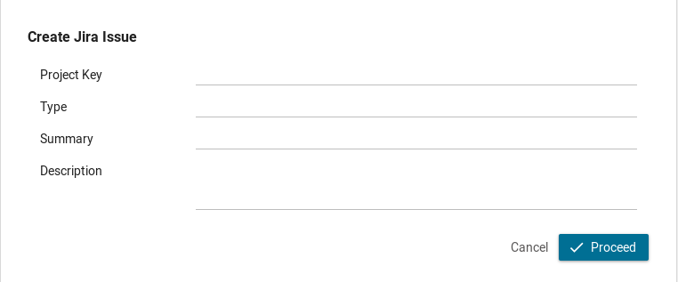

# Jira Connector

[Atlassian Jira](https://www.atlassian.com/software/jira) ist ein weit
verbreitetes Projektmanagement- und Issue-Tracking-Tool, das Teams dabei
unterstützt, Software effizient zu planen, zu verfolgen und zu veröffentlichen.
Es bietet eine benutzerfreundliche Oberfläche zum Erstellen von Aufgaben, zum
Zuweisen dieser Aufgaben an Teammitglieder, zum Festlegen von Prioritäten und
Fristen sowie zum Überwachen des Fortschritts.

**Der Atlassian Jira Connector von Axon Ivy** integriert die leistungsstarken
Funktionen von Jira nahtlos in Ihre Arbeitsabläufe, sodass Sie diese in Ihren
Prozessen nutzen können.

Dieser Konnektor bietet:

- Drei wichtige Funktionen: Kommentare erstellen, Probleme erstellen und
  Probleme abrufen.
- Zugriff auf die Kern-API von Atlassian Jira, sodass Sie programmgesteuert mit
  der Plattform interagieren können.
- Eine Demo-Implementierung, die Ihren Integrationsaufwand minimiert und Citizen
  Developers die Möglichkeit gibt, Jira ohne Programmieraufwand zu integrieren.

Durch die Verwendung des Atlassian Jira Connectors von Axon Ivy können Sie Ihre
Projektmanagement- und Issue-Tracking-Prozesse optimieren und so eine
reibungslose Zusammenarbeit und effiziente Softwareentwicklung gewährleisten.

## Demo




## Setup

Öffnen Sie die Datei „ `Config/variables.yaml”` in Ihrem Axon Ivy Designer,
fügen Sie den folgenden Code ein und passen Sie die Werte an Ihre Umgebung an.

```
Variables:

  jiraConnector:

    # Url to the Jira server
    Url: "https://localhost"

    # Username to connect to the Jira server
    Username: "admin"

    # Password to connect to the Jira server
    Password: "1234"
```
> [!HINWEIS] Der variable Pfad `jira-connector` wurde ab Version 13 in
> `jiraConnector` umbenannt.
